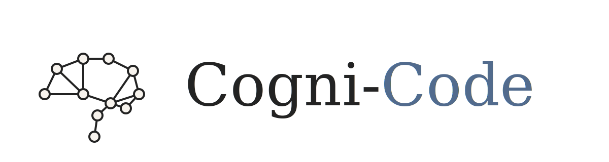

# Cogni-Code

<div align="center">



**Give your AI agent a memory that outlasts the session.**

[](./LICENSE)

</div>

Persistent, inspectable memory for Claude Code, OpenCode, and any MCP-compatible agent. Your agent remembers your preferences, your decisions, your corrections — and gets better every session. Memory lives as plain files on disk. Search it, edit it, diff it, back it up with git.

---

## Contents

- [Install](#install)
- [Quick start](#quick-start)
- [How it works](#how-it-works)
- [Pipeline](#pipeline)
- [Notion Sync](#notion-sync)
- [Skills](#skills)
- [Tool reference](#tool-reference)
- [Slash commands](#slash-commands)
- [Dashboard](#dashboard)
- [Where memory lives](#where-memory-lives)
- [Why this is different](#why-this-is-different)

---

## Install

**Claude Code:**

```bash
git clone https://github.com/ConnorCallahan01/cogni-code.git
cd cogni-code/graph-memory-plugin
./bin/install.sh
```

**OpenCode:**

```bash
git clone https://github.com/ConnorCallahan01/cogni-code.git
cd cogni-code/graph-memory-plugin
./bin/install-opencode.sh
```

Both installers register the MCP server, wire up session hooks, and install slash commands. Then run:

```
/memory-onboard
```

The onboard wizard walks you through graph root, runtime mode, and seeds your first memory nodes.

---

## Quick start

```text
# 1. Initialize
/memory-onboard

# 2. Teach it something
graph_memory(
  action="remember",
  path="preferences/deployment",
  gist="Always use blue-green deploys for production services",
  content="Blue-green for prod. Canary for staging. Never direct push.",
  tags=["preferences", "deployment"],
  confidence=0.9
)

# 3. Recall it next session (or next week)
/recall deployment strategy

# 4. Check what your agent knows
/memory-status

# 5. See the full history
graph_memory(action="history")
```

That's it. Write memory, retrieve memory, inspect memory. The background pipeline handles the rest.

---

## How it works

```
  your conversation
        │
        ▼
  ┌──────────────┐     ┌───────────────┐
  │ session hooks │────▶│ graph_memory  │   ← MCP tool (read/write/search/recall)
  │ capture state │     │ tool surface  │
  └──────────────┘     └──────┬────────┘
                              │
                 ┌────────────▼────────────┐
                 │     background pipeline  │
                 │                          │
                 │  scribe → auditor →      │   ← active pipeline (always runs)
                 │  librarian → dreamer     │
                 │                          │
                 │  observer (writes to     │   ← always active, single node store
                 │  nodes/ alongside main)  │
                 │                          │
                 │  compressor, dreamer-v3  │   ← code present, not active by default
                 └────────────┬────────────┘
                              │
                 ┌────────────▼────────────┐
                 │     ~/.graph-memory/     │
                 │                          │
                 │  mind/model.json         │   ← cognitive profile (always active)
                 │  lenses/{project}/       │   ← project models (always active)
                 │  sessions/{project}.jsonl│   ← session logs (always active)
                 │  nodes/                  │   ← knowledge graph (canonical store)
                 │  dreams/                 │   ← creative associations
                 └─────────────────────────┘
```

**Mental model data is always active** — `mind/model.json`, `lenses/`, `sessions/`, and observations run unconditionally as part of the merged architecture. There is no separate "v3 mode."

**Capture** — Session hooks watch your conversations and extract what changed.

**Process** — The scribe extracts structured deltas. The auditor detects stale and contradictory nodes. The librarian applies judgment-heavy updates and regenerates context. The dreamer creates speculative cross-node associations.

**Observe** — The observer produces structured observations from conversation patterns (how you think, what you keep correcting, where workflows stall). Observations flow into the shared `nodes/` store and feed mental model data.

**Inject** — Next session starts with layered context: mental-model (`model.json` direct, unconditional) → MAP (per-project) → PINNED → WORKING.

**Evolve** — Memory decays when unused. Nodes archive gracefully. Dreams surface unexpected connections. Everything is git-backed and reversible.

---

## Pipeline

The memory system runs a multi-stage background pipeline. Most of this happens automatically — you talk, it learns.

### Active pipeline

| Stage | What it does |
|-------|-------------|
| **Scribe** | Extracts structured deltas from conversation buffers — captures evolving opinions, frustrations, contradictions, not just hard facts |
| **Auditor** | Mechanical triage: detects stale nodes, contradictions, noise/bloat candidates |
| **Librarian** | Applies graph updates with a prune-over-preserve philosophy. Regenerates context files |
| **Dreamer** | Creates speculative cross-node associations — creative recombination at temperature 1.0 |
| **Observer** | Produces structured observations and session logs from conversation patterns. Writes to the shared `nodes/` store |
| **Skillforge** | Converts high-access memory nodes into executable slash command skills automatically |
| **Bootstrap** | Auto-generates project docs (CLAUDE.md / AGENT.md) from mental models |
| **Working update** | Extracts key files from tool traces — primes the next session with files you actually edited |

### Mental model data (always active)

The system runs a **merged v2/v3 hybrid** architecture. There is no separate "v3 pipeline." Mental model data is always active:

| Data | What it provides |
|------|-----------------|
| `mind/model.json` | Cognitive style, decision patterns, preferences, guardrails, emotional profile |
| `lenses/{project}/` | Per-project tech stack, conventions, active work, open threads |
| `sessions/{project}.jsonl` | Shipped work, decisions, blocked items, next-session hints |
| `observations.jsonl` | Append-only observation feeds (global and per-project) |

Session-start injection composition: **mental-model (model.json direct, unconditional) → MAP (per-project) → PINNED → WORKING**.

### Inactive stages (code present, not active by default)

| Stage | What it does |
|-------|-------------|
| **Compressor** | Folds observations into compressed mental models, generates whisper paragraphs |
| **Dreamer V3** | Creative recombination against compressed mental models instead of raw nodes |

These stages exist in the codebase and can be re-enabled if needed. The active pipeline is battle-tested and runs by default.

---

## Notion Sync

Two-way sync between your graph memory and a Notion workspace. Browse, edit, and organize your agent's memory in a human-readable interface — changes flow back.

**Outbound** — Graph state mirrors to Notion: knowledge nodes become wiki pages, decisions and briefs become database rows.

**Inbound** — Human edits in Notion are detected and turned into observations and deltas (never direct node mutations).

**Three-way merge** — When both sides change, human intent wins. Agent information is preserved as callouts.

**5 steward agents** manage scoped sync areas: knowledge, project, tasks, enrichment, and workspace structure.

**Chunked sync** — 100 items per batch, sorted by confidence. The daemon auto-enqueues the next batch.

```text
# Create the Notion workspace structure
/notion-setup

# Run outbound sync (diff → plan → execute)
/notion-sync

# Merge batched wiki pages into category pages
/notion-consolidate

# Or use the tool directly:
graph_memory(action="notion_setup")
graph_memory(action="notion_sync")
graph_memory(action="notion_consolidate")
```

Triggered daily by the daemon (configurable hour), or manually via slash command. Disk is the agent-readable source of truth; Notion is the human-readable presentation layer.

---

## Skills

Cogni-Code ships with skills that integrate directly into your agent's workflow. These aren't plugins you configure — they're slash commands and tools that become part of how your agent operates.

### Built-in slash commands

| Command | What it does |
|---------|-------------|
| `/memory-onboard` | First-run setup: storage, runtime, seed memory |
| `/memory-status` | Graph health snapshot — node counts, confidence, warnings |
| `/memory-search <query>` | Keyword search across all knowledge |
| `/recall <query>` | Deep graph lookup with edge traversal |
| `/memory-morning-kickoff` | Start-of-day briefing built from your memory |
| `/memory-wire-project` | Inject memory context into your project's CLAUDE.md or AGENT.md |
| `/memory-switch-harness` | Switch background pipeline worker (codex, claude, pi, opencode) |
| `/memory-connect-inputs` | Configure external inputs (Gmail, Calendar, Slack) for briefings |
| `/memory-input-refresh` | Refresh configured external input sources |
| `/refresh-skill` | Update a skillforged skill whose source node has drifted |
| `/notion-setup` | Create Notion workspace structure (databases + wiki pages) |
| `/notion-sync` | Run outbound sync — diff, plan, execute graph-to-Notion mirror |
| `/notion-consolidate` | Merge batched wiki pages into category pages |

### Auto-generated skills (Skillforge)

Skillforge watches your memory graph for nodes that get accessed frequently — patterns you keep recalling, procedures you keep following, decisions you keep referencing. When a node crosses a scoring threshold, it gets converted into an executable slash command skill.

This means your agent *writes its own tools* based on what it keeps looking up. Skills auto-refresh when the source node content changes.

```text
# This happens automatically:
# 1. You recall "ssh provisioning" across 8 sessions
# 2. Skillforge converts it into a /provision-ssh slash command
# 3. Next time, your agent just runs the skill

# You can also trigger a refresh manually:
/refresh-skill
```

### Included agent skills

The plugin ships with a `graph-memory` skill that teaches your agent when and how to use memory — when to recall before debugging, when to remember a corrected mistake, when to record a decision. Your agent gets memory-literate out of the box.

---

## Tool reference

The `graph_memory` MCP tool is the primary interface. Your agent uses it directly.

| Action | Description |
|--------|-------------|
| `remember` | Create or update a durable memory node |
| `recall` | Search plus multi-hop edge traversal |
| `search` | Keyword search over the graph index |
| `read_node` | Read a specific node by path |
| `list_edges` | See connections from a node |
| `write_note` | Save a working note into the session buffer |
| `read_dream` | Read pending dream fragments |
| `status` | Graph health, runtime state, node counts |
| `history` | Git-backed change log |
| `revert` | Roll back to an earlier state |
| `resurface` | Restore an archived node to active memory |
| `initialize` | Create graph structure and pointer file |
| `configure_runtime` | Choose manual or Docker runtime |
| `consolidate` | Run consolidation manually |
| `notion_setup` | Create Notion workspace structure (databases + wiki pages) |
| `notion_sync` | Run outbound sync (diff + plan + execute) |
| `notion_consolidate` | Merge batched wiki pages into category pages |

---

## Slash commands

Installed for both Claude Code and OpenCode during setup. See [Built-in slash commands](#built-in-slash-commands) above for the full list.

---

## Dashboard

Optional local inspection UI — see exactly what your agent knows.

```bash
cd memory-dashboard
npm install && npm run dev
```

- **Architecture view** — inspect your mental model, project models, whisper paragraphs, inject flow
- **Graph explorer** — interactive node graph with inline editing
- **Session replay** — per-session event timeline with tool traces and delta previews
- **Pipeline status** — real-time view of scribe → auditor → librarian → dreamer chain
- **Dream actions** — accept or reject speculative associations
- **Memory health** — node count, average confidence, category coverage, staleness score

Server runs on port 3001. Frontend on port 5173.

---

## Where memory lives

Everything is plain text on your filesystem. No database, no hidden vector store.

```text
~/.graph-memory/
  mind/
    model.json              # Cognitive profile, preferences, guardrails
    whisper.txt             # Compressed injection paragraph (~300 tokens)
    observations.jsonl      # Raw observation feed
  lenses/
    {project}/
      model.json            # Project model (tech stack, conventions, active work)
      whisper.txt           # Project-specific compressed context
      observations.jsonl    # Project observations
  sessions/
    {project}.jsonl         # Session logs (shipped, decided, blocked, next)
  nodes/                    # Durable knowledge graph nodes (markdown + YAML)
  archive/                  # Decayed nodes — resurface to restore
    v3-graph-backup/        # Archived diverged v3 graph directory
  dreams/                   # Speculative associations awaiting validation
  working/                  # Per-project volatile context + key files
  briefs/
    daily/                  # Daily brief outputs
  .inputs/                  # External brief inputs (gmail, calendar, slack)
  .notion-sync-state.json   # Notion workspace sync state
  MAP.md                    # Compressed knowledge index
  WORKING.md                # Active session context
```

Your memory is just files. Open them, grep them, edit them, back them up. Git tracks every change.

---

## Why this is different

**Filesystem is the database.** Every node is a markdown file with YAML frontmatter. No opaque vector store, no hidden ranking layers. You can read your agent's memory with `cat`.

**Behavioral, not factual.** This isn't storing your grocery list. It's learning your decision patterns, your corrections, your guardrails. The mental model captures *how you think*, not just *what you said*.

**Memory decays.** Nodes lose confidence when unused. Stale knowledge archives itself. But it's not gone — `resurface` brings it back. Memory that only grows is memory that becomes noise.

**It writes its own tools.** Skillforge converts frequently-accessed knowledge into executable slash commands. Your agent literally generates its own workflows from what it keeps looking up.

**Git-backed.** Every consolidation is a commit. Inspect what changed, revert mistakes, diff between sessions. Your memory has a full history.

**Notion as a mirror.** Sync your memory to a human-readable Notion workspace. Browse, edit, organize. Edits flow back. Disk is agent truth; Notion is presentation.

**Inspectable by design.** The dashboard shows exactly what your agent knows. Edit a node if it's wrong. Accept a dream if it's insightful. Delete what's noise. No black box.

---

## Read next

- **[Setup guide](docs/setup-from-clone.md)** — detailed clone-to-first-memory walkthrough
- **[Plugin README](graph-memory-plugin/README.md)** — full architecture and configuration
- **[Examples](examples/)** — commands, tool actions, skill usage, SDK integration
- **[CHANGELOG](graph-memory-plugin/CHANGELOG.md)** — version history

---

## Project structure

```text
graph-memory-plugin/    # The installable plugin — start here
  src/graph-memory/     # Core logic, pipeline, mental model, adapters
  agents/               # Background worker instructions (scribe, auditor, librarian, dreamer, observer, compressor)
  bin/                  # Install scripts and Docker helpers
  commands/             # Slash commands (Claude Code)
  opencode-commands/    # Slash commands (OpenCode)
  skills/               # Memory skill + /recall
  extensions/           # Plugin entry points (Claude Code, OpenCode, pi)
  templates/            # Memory section templates

memory-dashboard/       # Optional inspection UI (React + Express)
docs/                   # Setup guides and diagrams
examples/               # Command examples, tool actions, SDK usage
```

If you're here because you want an agent that remembers — you're in the right place.
