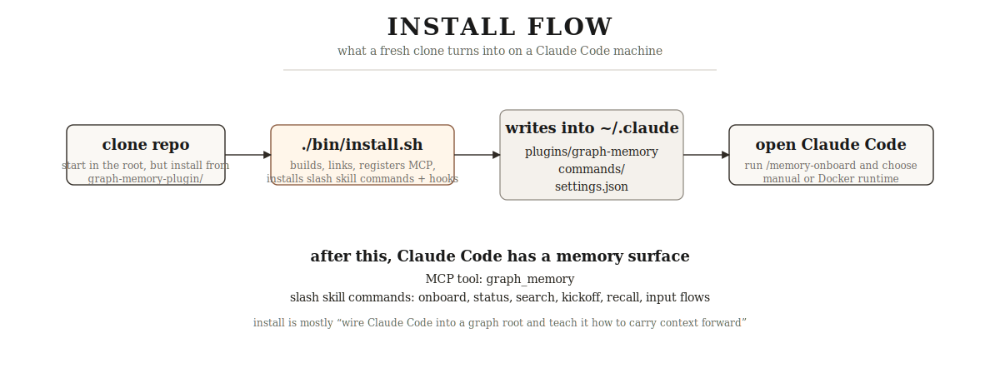
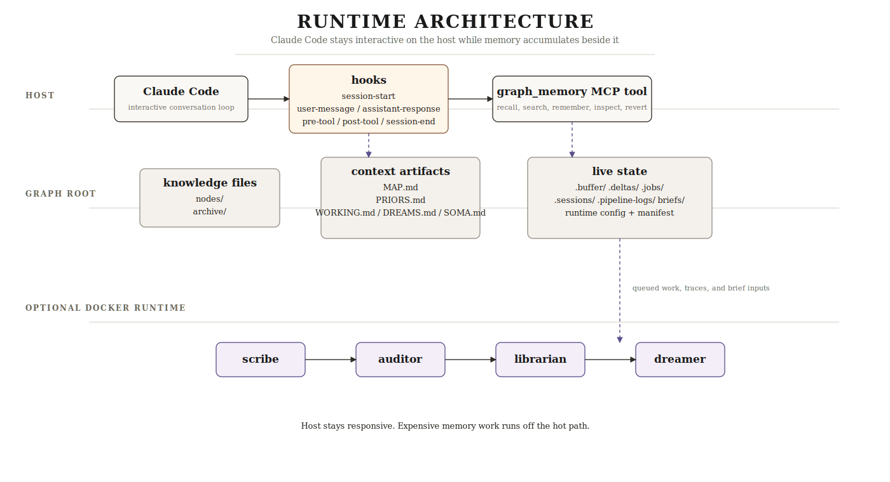
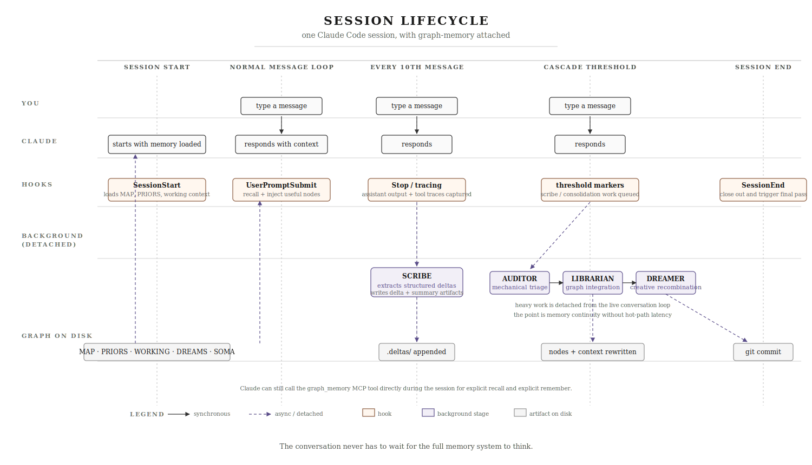

# graph-memory

<div align="center">

## Give your agent a past

**A filesystem-first memory graph for Claude Code and long-lived AI workflows**

*Not a vector DB. Not a prompt scrapbook. Not a black box.*

*A visible memory system that lives on disk, improves with use, and can be searched, edited, diffed, and rolled back.*

</div>

---

## Why This Exists

Most agent sessions are brilliant and disposable.

The model learns your style, adapts to a repo, notices recurring mistakes, and starts to become useful in a deeper way. Then the session ends, and tomorrow it begins again from zero.

`graph-memory` is an attempt to fix that without hiding memory behind infrastructure you cannot inspect.

It stores memory as markdown nodes, compresses the graph into prompt-ready artifacts like `MAP.md` and `PRIORS.md`, gives Claude Code a real memory tool surface, and optionally runs a background pipeline that turns recent interaction history into structured graph updates.

The goal is simple:

- let the agent remember what matters
- let that memory stay inspectable
- let behavior improve from repetition
- let stale memory fade instead of accumulating forever

---

## Choose Your Path

If you cloned this repo, pick the path that matches what you want:

| If you want... | Start here |
|---|---|
| basic persistent memory in Claude Code | [Quick Start](#quick-start) |
| the full background pipeline | [Runtime Modes](#runtime-modes) |
| concrete command and tool examples | [Five-Minute First Success](#five-minute-first-success) |
| the current plugin surface | [`graph-memory-plugin/`](./graph-memory-plugin/) |
| debugging / observability | [`memory-dashboard/`](./memory-dashboard/) |
| the full setup walkthrough | [docs/setup-from-clone.md](./docs/setup-from-clone.md) |

---

## The System In Three Diagrams

### 1. Install Flow



### 2. Runtime Architecture



### 3. Memory Lifecycle



---

## What Makes This Different

### Filesystem First

The filesystem is the database.

Memory is made of files you can:

- open
- grep
- diff
- review in git
- back up normally
- edit by hand if needed

### Memory, Not Retrieval Theater

This project is opinionated.

If what you want is “dump everything into embeddings and pull back vaguely related chunks,” this is not that.

`graph-memory` favors:

- explicit graph structure
- compressed, inspectable summaries
- durable behavioral priors
- memory that can decay, archive, and return

over:

- hidden ranking layers
- opaque retrieval behavior
- memory that only grows

### Behavior Matters, Not Just Facts

The system is not only trying to remember:

- names
- repos
- preferences
- decisions

It is also trying to remember:

- how you like tradeoffs framed
- what kinds of agent behavior you keep correcting
- where workflows keep stalling
- what rules belong in `CLAUDE.md`

That is the interesting part.

---

## Capability Map

| Capability | What it means | State |
|---|---|---|
| durable graph nodes | markdown memory nodes with confidence, tags, edges, soma markers, timestamps | stable core |
| recall + search | keyword search, multi-hop recall, direct node reads | stable core |
| direct memory writes | `remember`, `write_note`, `resurface`, git history, revert | stable core |
| startup context loading | `MAP.md`, `PRIORS.md`, working context loaded through hooks | stable core |
| background pipeline | `scribe -> auditor -> librarian -> dreamer` | advanced / optional |
| Docker runtime helpers | bootstrap, health checks, status, auth import, runtime env | advanced / optional |
| morning kickoff | repo-specific start-of-day briefing from memory | available, still evolving |
| daily brief analysis | 7-day trends, open loops, agent friction, suggested `CLAUDE.md` upgrades | present in current codebase, still evolving |
| session/tool tracing | assistant traces + tool traces for richer operator insight | present in current codebase, still evolving |
| external inputs | Gmail / Calendar / Slack-ready config for briefing flows | present in current codebase, still evolving |
| dashboard | inspect nodes, graph, deltas, traces, logs, pipeline state, briefs | local/dev-facing, valuable for operators |

---

## Quick Start

```bash
git clone https://github.com/ConnorCallahan01/graph-memory.git
cd graph-memory/graph-memory-plugin
./bin/install.sh
```

Then open Claude Code and run:

```text
/memory-onboard
```

That flow will walk through:

1. choosing a graph root
2. selecting runtime mode
3. bootstrapping Docker if you want the full pipeline
4. seeding the first durable memory nodes

The full setup guide is here:

- [docs/setup-from-clone.md](./docs/setup-from-clone.md)

---

## Five-Minute First Success

If you want to feel the system immediately, do this:

### Step 1: Initialize

```text
/memory-onboard
```

### Step 2: Check Status

```text
/memory-status
```

You should see a graph root, initialization state, runtime mode, node count, and warning summary.

### Step 3: Teach It Something Durable

```text
graph_memory(
  action="remember",
  path="preferences/review_style",
  gist="Prefers direct reviews with findings first.",
  content="Lead with concrete bugs and risks before recap. Skip fluff.",
  tags=["preferences", "review"],
  confidence=0.9,
  pinned=true
)
```

### Step 4: Recall It

```text
/recall review style
```

or:

```text
graph_memory(action="recall", query="review style", depth=2)
```

### Step 5: Inspect History

```text
graph_memory(action="history")
```

At that point you have already used the system for:

- memory write
- memory retrieval
- memory-aware status inspection
- graph-backed persistence

More examples:

- [examples/claude-code-commands.md](./examples/claude-code-commands.md)
- [examples/mcp-tool-actions.md](./examples/mcp-tool-actions.md)
- [examples/skill-usage.md](./examples/skill-usage.md)
- [examples/agent-sdk.ts](./examples/agent-sdk.ts)

---

## The Main Skill-Command Surface

These slash entries are technically skill commands installed into Claude Code.

| Skill command | Job |
|---|---|
| `/memory-onboard` | first-run setup, storage choice, runtime choice, memory seeding |
| `/memory-status` | graph + runtime health snapshot |
| `/memory-search <query>` | keyword search across graph knowledge |
| `/memory-morning-kickoff` | repo-specific start-of-day kickoff built from memory |
| `/recall <query>` | deeper graph lookup with edge traversal |
| `/memory-connect-inputs` | host-side external-input setup for briefing flows |
| `/memory-input-refresh` | refreshes configured external-input sources |

And the MCP tool surface:

```text
graph_memory(action="initialize", graphRoot="...")
graph_memory(action="configure_runtime", runtimeMode="docker")
graph_memory(action="status")
graph_memory(action="remember", ...)
graph_memory(action="search", query="...")
graph_memory(action="recall", query="...", depth=2)
graph_memory(action="read_node", path="...")
graph_memory(action="list_edges", path="...")
graph_memory(action="history")
graph_memory(action="revert", path="<commit>")
```

---

## Runtime Modes

### Manual

Use this if you want the simplest working setup.

- MCP tool + graph storage
- no daemon container
- good for testing, experimentation, or smaller workflows

### Docker Daemon

Use this if you want the system to behave like a full memory runtime instead of a passive store.

- Claude Code stays on the host
- graph root stays on the host
- daemon and bounded workers run in Docker
- helper scripts manage bootstrap, health, auth, and status

Useful helpers:

- `bin/docker-bootstrap.sh`
- `bin/docker-doctor.sh`
- `bin/docker-auth-check.sh`
- `bin/docker-build.sh`
- `bin/docker-start.sh`
- `bin/docker-stop.sh`
- `bin/docker-status.sh`
- `bin/docker-codex-import-host-auth.sh`
- `bin/docker-codex-login.sh`
- `bin/docker-codex-login-api-key.sh`

---

## What Gets Installed

Running `graph-memory-plugin/bin/install.sh`:

1. installs plugin dependencies if needed
2. builds the plugin
3. symlinks the plugin into `~/.claude/plugins/graph-memory`
4. registers the MCP server in `~/.claude.json`
5. installs slash skill commands into `~/.claude/commands/`
6. registers Claude Code hooks in `~/.claude/settings.json`

That gives you:

- a live MCP server
- command entrypoints
- auto-loaded startup context
- session capture hooks
- session-end consolidation hooks

---

## What Lives In The Graph Root

By default, the graph root lives at `~/.graph-memory/`, with a pointer file at `~/.graph-memory-config.yml`.

A healthy graph root looks roughly like this:

```text
~/.graph-memory/
  nodes/                 durable memory nodes
  archive/               decayed or retired memory
  dreams/                speculative fragments
  briefs/daily/          daily brief markdown + JSON
  working/               global + per-project working context
  .buffer/               recent interaction buffer
  .deltas/               extracted changes awaiting consolidation
  .jobs/                 queued/running/done/failed pipeline jobs
  .pipeline-logs/        worker logs
  .sessions/             per-session traces
  MAP.md                 compressed map of known things
  PRIORS.md              learned behavior and style priors
  SOMA.md                emotional weighting / salience
  WORKING.md             active context
  DREAMS.md              dream summary context
  manifest.yml           graph metadata
```

This is one of the project’s best properties:

> your memory is just files

That keeps the system legible.

---

## What A Fresh Clone Actually Contains

Main surfaces:

- [`graph-memory-plugin/`](./graph-memory-plugin/): the installable plugin
- [`memory-dashboard/`](./memory-dashboard/): optional local inspection UI
- [`docs/`](./docs/): setup and repo notes
- [`examples/`](./examples/): concrete command, tool, skill, and SDK examples

Older or auxiliary development surfaces:

- [`src/`](./src/)
- [`tests/`](./tests/)
- [`public/`](./public/)
- [`graph-memory/`](./graph-memory/)
- [`test-app/`](./test-app/)

The center of gravity is the plugin.

If you are evaluating the project, start there.

---

## State Of The Project

### Stable Core

- graph-backed durable memory
- MCP tool surface
- startup context artifacts
- git-backed memory history
- plugin install flow

### Advanced But Worth Using

- Docker daemon runtime
- structured pipeline jobs
- graph decay / archive / resurface behavior
- richer command-driven workflows

### Actively Evolving Surfaces

- morning briefing / kickoff flows
- tool and assistant trace analysis
- external-input ingestion
- dashboard breadth

That split is deliberate. The README should help you understand both what is dependable now and what is expanding quickly.

---

## Read Next

1. [docs/setup-from-clone.md](./docs/setup-from-clone.md)
2. [graph-memory-plugin/README.md](./graph-memory-plugin/README.md)
3. [examples/claude-code-commands.md](./examples/claude-code-commands.md)
4. [examples/mcp-tool-actions.md](./examples/mcp-tool-actions.md)
5. [examples/skill-usage.md](./examples/skill-usage.md)

If you are here because you want an agent with a memory, that path will get you there fast.
